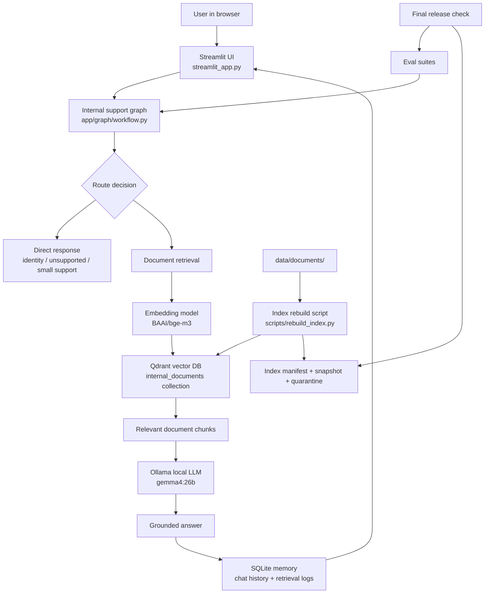

# MIC 9000 Internal RAG Chatbot

MIC 9000 is an internal AI assistant for the Manufacturing Improvement Yokoten Center (MIC). It helps users ask questions about approved internal documents, get grounded answers, inspect the sources used by the answer, and monitor the health of the chatbot system.

This README is written for a new maintainer who may not have AI, RAG, Qdrant, Ollama, or Streamlit experience yet. After reading this file, you should understand what the project does, how the main parts work, how to run it, how to rebuild the knowledge base, and how to check whether it is safe to use in production.

---

## 1. What problem does this project solve?

Before MIC 9000, internal knowledge may be spread across Markdown files, PDFs, notes, runbooks, project documents, and technical instructions. A user needs to know where to search and how to interpret the document.

MIC 9000 makes this easier:

1. The maintainer puts approved documents into `data/documents/`.
2. The system reads those documents and stores searchable chunks in Qdrant.
3. A user asks a question in the Streamlit web app.
4. MIC 9000 searches the approved documents.
5. MIC 9000 sends the most relevant document chunks to a local LLM through Ollama.
6. The LLM writes an answer based on those chunks.
7. The UI shows the answer, sources, runtime health, and developer trace when allowed.

The important idea is this:

> MIC 9000 should answer from approved internal documents, not from random internet knowledge.

---

## 2. Simple explanation of RAG

MIC 9000 is a RAG chatbot.

RAG means **Retrieval-Augmented Generation**.

In simple terms:

- **Retrieval** = search the internal documents first.
- **Augmented** = give the searched document text to the AI model.
- **Generation** = ask the AI model to write an answer using that text.

Why this matters:

- A normal chatbot may answer from general training knowledge.
- MIC 9000 first searches the company-approved documents.
- This makes answers more specific, inspectable, and safer for internal use.

---

## 3. Current production direction

The final active UI is **Streamlit**.

Chainlit was tested earlier, but it was removed from the active production path because this project needs a real sidebar, document controls, diagnostics panels, source inspectors, and admin/developer panels. Streamlit gives better control for this internal operations-console style.

Current production stack:

| Layer | Tool | Simple meaning |
|---|---|---|
| Web UI | Streamlit | The browser app users interact with |
| LLM runtime | Ollama | Runs the local language model |
| LLM model | `gemma4:26b` | The local model that writes answers |
| Embedding model | `BAAI/bge-m3` | Converts text into searchable vectors |
| Vector database | Qdrant | Stores document chunks for semantic search |
| Chat memory | SQLite | Stores chat sessions, messages, retrieval logs, and sources |
| Evaluation | JSON eval suites | Automated tests for expected answer behavior |
| Release gate | Shell + Python scripts | Final checks before saying the system is production-ready |

---

## 4. High-level architecture



---

## 5. How a question is answered

Example user question:

```text
How do I rebuild the production index?
```

What happens internally:

1. Streamlit receives the question.
2. Streamlit sends the question and current chat session ID to the backend graph.
3. The graph decides what type of question it is.
4. If document search is needed, the retriever searches Qdrant.
5. Qdrant returns the most relevant document chunks.
6. The backend sends those chunks plus the user question to Ollama.
7. Ollama generates the final answer.
8. The answer is saved to SQLite.
9. The sources and retrieval trace are saved to SQLite.
10. Streamlit displays the answer, sources, and optional developer trace.

---

## 6. Important folders and files

Actual repository names may change slightly, but the current project is organized like this:

```text
internal-chatbot/
├── streamlit_app.py                    # Main Streamlit web app
├── app/
│   ├── config.py                       # Environment/config settings
│   ├── graph/                          # Request routing and workflow logic
│   │   ├── router.py
│   │   ├── state.py
│   │   └── workflow.py
│   ├── rag/                            # Retrieval and vector-store logic
│   │   ├── retriever.py
│   │   ├── rag_chain.py
│   │   └── vector_store.py
│   ├── memory/                         # SQLite memory models and storage
│   ├── services/                       # Runtime, diagnostics, indexing, knowledge base
│   │   ├── runtime.py
│   │   ├── runtime_diagnostics.py
│   │   ├── knowledge_base.py
│   │   ├── index_safety.py
│   │   └── index_manifest.py
│   ├── eval/                           # Evaluation harness code
│   └── ui/
│       └── styles.py                   # Streamlit CSS and UI helpers
├── data/
│   ├── documents/                      # Approved production documents
│   ├── staging/                        # Temporary uploaded/staged documents
│   └── sqlite/                         # SQLite chat database, usually not committed
├── eval_suites/                        # JSON test suites
├── eval_reports/                       # Generated eval reports, usually not committed
├── scripts/
│   ├── rebuild_index.py                # Rebuild Qdrant index from documents
│   ├── run_streamlit_prod.sh           # Start Streamlit with production env
│   ├── run_release_checks.sh           # Main production release checks
│   ├── final_release_check.sh          # Final release-candidate gate
│   ├── ops_preflight.py                # Environment and service preflight checker
│   ├── check_production_readiness.py   # Production readiness checker
│   ├── backup_mic9000.sh               # Backup helper
│   └── restore_mic9000_backup.sh       # Restore helper
├── storage/
│   ├── index_manifests/                # Generated index rebuild records
│   ├── releases/                       # Generated release manifests
│   ├── backups/                        # Backup tarballs
│   └── ops_bundles/                    # Diagnostic bundles
├── docs/                               # Human-readable documentation
├── .env.production.example             # Safe example config
├── .env.production                     # Real config, do not commit
├── VERSION                             # Release version
└── README.md                           # This file
```

---

## 7. What should be inside `data/documents/`?

Only approved internal documents should be placed here.

Recommended current production document:

```text
data/documents/developer_support/mic9000_internal_rag_chatbot_runbook.md
```

Do not keep unrelated personal files in production documents, for example:

```text
data/documents/company_info/KFC_menu.pdf
```

After changing documents, always rebuild the index and run release checks.

---

## 8. Environment file

The project is controlled by `.env.production`.

Start from the template:

```bash
cp .env.production.example .env.production
nano .env.production
```

Important production values:

```env
APP_ENV=production
APP_NAME="MIC 9000"
DEBUG=false

MIC_INDEX_MODE=production
MIC_SECURITY_ENABLED=true
MIC_SECURITY_PUBLIC_TRACE=false
MIC_SECURITY_PUBLIC_DIAGNOSTICS=false
MIC_DISPLAY_UNLOCK_HINTS=false
MIC_ADMIN_ACTIONS_ENABLED=false

OLLAMA_BASE_URL=http://localhost:11434
OLLAMA_MODEL=gemma4:26b

QDRANT_URL=http://localhost:6333
QDRANT_COLLECTION_NAME=internal_documents
QDRANT_DENSE_VECTOR_NAME=dense

EMBEDDING_MODEL_NAME=BAAI/bge-m3
SQLITE_DB_PATH=data/sqlite/chat_history.db
DOCUMENTS_DIR=data/documents
STAGING_DIR=data/staging
```

Security tokens must be set in `.env.production`:

```env
MIC_DEVELOPER_TOKEN=change-this
MIC_ADMIN_TOKEN=change-this-too
```

Never commit the real `.env.production` file to GitHub.

---

## 9. First-time setup on a fresh machine

### Step 1: Clone the repo

```bash
git clone https://github.com/NMB-MIC/internal-chatbot.git
cd internal-chatbot
```

### Step 2: Create Python environment

Recommended Python version: **Python 3.11**.

```bash
python3.11 -m venv .venv
source .venv/bin/activate
python -m pip install --upgrade pip
```

Install dependencies:

```bash
pip install -r requirements.txt
```

If the repo uses `pyproject.toml` instead of `requirements.txt`, use:

```bash
pip install -e .
```

### Step 3: Start Qdrant

Qdrant is the vector database. It stores the searchable document chunks.

Docker example:

```bash
docker run -d \
  --name mic9000-qdrant \
  -p 6333:6333 \
  -v "$(pwd)/storage/qdrant:/qdrant/storage" \
  qdrant/qdrant
```

Check Qdrant:

```bash
curl http://localhost:6333/collections
```

Expected result: HTTP 200 with JSON output.

### Step 4: Start Ollama

Ollama runs the local LLM.

```bash
ollama serve
```

In another terminal, pull the configured model:

```bash
ollama pull gemma4:26b
```

Check Ollama:

```bash
curl http://localhost:11434/api/tags
```

### Step 5: Create production env

```bash
cp .env.production.example .env.production
nano .env.production
```

Set the correct model, Qdrant URL, security tokens, and paths.

### Step 6: Add approved documents

Example:

```bash
mkdir -p data/documents/developer_support
cp mic9000_internal_rag_chatbot_runbook.md \
  data/documents/developer_support/mic9000_internal_rag_chatbot_runbook.md
```

### Step 7: Rebuild the index

```bash
set -a
source .env.production
set +a

python scripts/rebuild_index.py
```

This will:

1. Load documents from `data/documents/`.
2. Split them into chunks.
3. Convert chunks into embeddings using BGE-M3.
4. Store chunks in Qdrant.
5. Write a manifest into `storage/index_manifests/`.
6. Quarantine unsafe or unwanted files if production safety rules are enabled.

### Step 8: Run release checks

```bash
bash scripts/run_release_checks.sh .env.production
```

For final release gate:

```bash
bash scripts/final_release_check.sh .env.production
```

Expected final line:

```text
FINAL RELEASE CHECK: PASS
```

### Step 9: Start the Streamlit app

Recommended:

```bash
bash scripts/run_streamlit_prod.sh .env.production
```

Manual equivalent:

```bash
set -a
source .env.production
set +a

streamlit run streamlit_app.py --server.address 0.0.0.0 --server.port 8000
```

Open in browser:

```text
http://localhost:8000
```

Or from another machine on the same network:

```text
http://<server-ip>:8000
```

---

## 10. Daily operation guide

### Start the app

```bash
bash scripts/run_streamlit_prod.sh .env.production
```

### Stop the app

If running in a terminal, press:

```text
Ctrl + C
```

If running as a background process or service, stop the service according to the deployment method used.

### Check if the system is healthy

```bash
bash scripts/run_release_checks.sh .env.production
```

Or run only preflight:

```bash
python scripts/ops_preflight.py --env-file .env.production
```

### Add a new document

Option A: Copy directly into `data/documents/`:

```bash
mkdir -p data/documents/developer_support
cp new_document.md data/documents/developer_support/new_document.md
```

Then rebuild:

```bash
set -a
source .env.production
set +a
python scripts/rebuild_index.py
```

Option B: Use Streamlit developer/admin staging controls if enabled.

### Remove a document

```bash
rm -f data/documents/path/to/document.md
```

Then rebuild:

```bash
set -a
source .env.production
set +a
python scripts/rebuild_index.py
```

### Verify after document changes

```bash
bash scripts/run_release_checks.sh .env.production
```

If the number of Qdrant points changes after adding/removing documents, that is normal. The important check is:

```text
active index matches latest manifest: true
```

---

## 11. Streamlit UI guide

The UI is designed like an internal operations console.

Main areas:

| Area | Purpose |
|---|---|
| Sidebar | Sessions, document controls, security, health, developer options |
| Main chat | User questions and MIC 9000 answers |
| Source inspector | Shows which document chunks were used |
| Developer trace | Shows route, retrieval, and metadata for debugging |
| Runtime diagnostics | Shows Qdrant, manifest, document inventory, and production status |

### Document scope modes

| Mode | Simple meaning | When to use |
|---|---|---|
| Auto | Let the system choose relevant documents | General questions |
| Prefer selected | Prefer the selected document but allow fallback | Normal document Q&A |
| Strict selected | Only use the selected document | Testing and validation |

### Sources toggle

Shows or hides retrieved source chunks.

Use sources when checking whether the answer came from the correct document.

### Developer trace

Developer-only diagnostic view. Use it when answers look wrong or retrieval behaves unexpectedly.

---

## 12. Security model

MIC 9000 has simple internal access levels:

| Level | Meaning |
|---|---|
| User | Normal chat and basic sources |
| Developer | Trace, diagnostics, debugging views |
| Admin | Dangerous operations, if explicitly enabled |

Production defaults should be conservative:

```env
MIC_SECURITY_ENABLED=true
MIC_SECURITY_PUBLIC_TRACE=false
MIC_SECURITY_PUBLIC_DIAGNOSTICS=false
MIC_DISPLAY_UNLOCK_HINTS=false
MIC_ADMIN_ACTIONS_ENABLED=false
```

Admin actions should remain disabled unless a responsible maintainer intentionally enables them.

---

## 13. Evaluation suites

Eval suites are automated tests that ask known questions and check whether the system answers correctly.

They are stored in:

```text
eval_suites/
```

Generated reports are stored in:

```text
eval_reports/
```

Run all release checks:

```bash
bash scripts/run_release_checks.sh .env.production
```

Current important suites may include:

```text
runbook_regression
document_mode_smoke
thai_runbook_smoke
```

Important: if the production document changes from the old machine-status runbook to the MIC 9000 project runbook, update the eval suites so they test MIC 9000 facts instead of old machine-status facts.

---

## 14. Production release process

Before calling the project production-ready, run:

```bash
bash scripts/final_release_check.sh .env.production
```

Expected output:

```text
FINAL RELEASE CHECK: PASS
```

The final release check should verify:

- Python files compile
- Streamlit app exists
- Qdrant is reachable
- Ollama/embedding dependencies are available
- Documents directory exists
- Manifest directory exists
- Security settings are production-safe
- Runtime diagnostics pass
- Eval suites pass
- Production readiness passes
- Release manifest is generated

Release manifests are written to:

```text
storage/releases/
```

Print a release summary:

```bash
python scripts/print_release_summary.py storage/releases/<release_manifest>.json
```

---

## 15. Backup and restore

### Backup

```bash
bash scripts/backup_mic9000.sh .env.production
```

Backups are usually written to:

```text
storage/backups/
```

A backup should include important state such as:

- SQLite chat database
- index manifests
- release manifests
- configuration templates
- important storage state

### Restore

Dry run first:

```bash
bash scripts/restore_mic9000_backup.sh storage/backups/<backup-file>.tar.gz --dry-run
```

Then restore only if you are sure:

```bash
bash scripts/restore_mic9000_backup.sh storage/backups/<backup-file>.tar.gz
```

---

## 16. Troubleshooting

| Problem | Likely cause | What to do |
|---|---|---|
| Streamlit does not start | Missing dependency or env issue | Run `python -m py_compile streamlit_app.py app/ui/*.py`, then check `.env.production` |
| Qdrant unreachable | Qdrant is not running | Start Qdrant and check `curl http://localhost:6333/collections` |
| Ollama unreachable | Ollama is not running | Run `ollama serve` and check `curl http://localhost:11434/api/tags` |
| Model not found | Ollama model not pulled | Run `ollama pull gemma4:26b` or update `OLLAMA_MODEL` |
| No sources shown | Source toggle off or retrieval found no chunks | Turn on sources, check document scope and rebuild index |
| Wrong document used | Scope mode too loose | Use `strict_selected` and select the correct document |
| Answers are outdated | Old index still active | Rebuild index and verify latest manifest |
| Release check fails after removing files | Eval suites still expect old documents | Update eval suites or restore the needed runbook |
| HF_TOKEN warning | Hugging Face token not configured | Optional; set `HF_TOKEN` for better download behavior |
| White text on white sidebar control | CSS regression | Check `app/ui/styles.py`, especially sidebar BaseWeb selectors |
| Admin controls missing | Admin actions disabled | Check `MIC_ADMIN_ACTIONS_ENABLED`; keep false in production unless needed |

---

## 17. Repository hygiene

Do not commit local runtime state, secrets, caches, or generated files.

Recommended files/folders to keep out of Git:

```text
.env
.env.production
.venv/
__pycache__/
*.pyc
.pytest_cache/
.streamlit/secrets.toml
logs/
data/sqlite/*.db
data/sqlite/*.db-*
storage/backups/
storage/ops_bundles/
storage/qdrant/
storage/releases/
eval_reports/
```

Documents in `data/documents/` should be committed only if they are approved internal documents and safe for the company repository.

---

## 18. Chainlit cleanup note

Chainlit is no longer the active UI runtime.

If these files still exist and are not used by any current import or deployment script, they can usually be archived or deleted:

```text
chainlit_app.py
chainlit.md
.chainlit/
requirements_chainlit.txt
public/mic9000.css
public/mic9000-mark.svg
app/ui/chainlit_bridge.py
app/ui/chainlit_history.py
app/ui/chainlit_renderers.py
app/ui/chainlit_settings.py
app/ui/chainlit_shell.py
scripts/run_chainlit.sh
deploy/systemd/mic9000-chainlit.service
deploy/nginx/mic9000.nginx.conf
```

Before deleting, check imports:

```bash
grep -R "chainlit\|chainlit_app\|app.ui.chainlit" -n . \
  --exclude-dir=.git \
  --exclude-dir=.venv
```

If nothing active references them, they are old UI migration leftovers.

---

## 19. Maintainer rules

1. Do not edit retrieval, routing, prompts, or index safety casually.
2. Any document change must be followed by an index rebuild.
3. Any production index rebuild must be followed by release checks.
4. Never commit `.env.production`, SQLite chat DB, backups, or generated reports.
5. Keep production documents small, approved, and relevant.
6. Keep admin actions disabled by default.
7. If an answer looks wrong, check sources first before changing prompts.
8. If a release check fails, fix the root cause before deploying.

---

## 20. Quick command reference

Start environment:

```bash
source .venv/bin/activate
```

Load production env:

```bash
set -a
source .env.production
set +a
```

Rebuild index:

```bash
python scripts/rebuild_index.py
```

Run Streamlit:

```bash
bash scripts/run_streamlit_prod.sh .env.production
```

Run release checks:

```bash
bash scripts/run_release_checks.sh .env.production
```

Run final release gate:

```bash
bash scripts/final_release_check.sh .env.production
```

Backup:

```bash
bash scripts/backup_mic9000.sh .env.production
```

Check Qdrant:

```bash
curl http://localhost:6333/collections
```

Check Ollama:

```bash
curl http://localhost:11434/api/tags
```

---

## 21. Current recommended production document set

For the clean handover version, use only the MIC 9000 project runbook unless another internal document is intentionally approved.

Recommended:

```text
data/documents/developer_support/mic9000_internal_rag_chatbot_runbook.md
```

Not recommended:

```text
data/documents/company_info/Apiwit_Tech_CV.pdf
old synthetic test documents
Blood Meridian or other external books
sample stress-test files
personal files
```

After removing unrelated documents, run:

```bash
set -a
source .env.production
set +a

python scripts/rebuild_index.py
bash scripts/run_release_checks.sh .env.production
```

If the release checks pass, the project is ready for internal operation.
